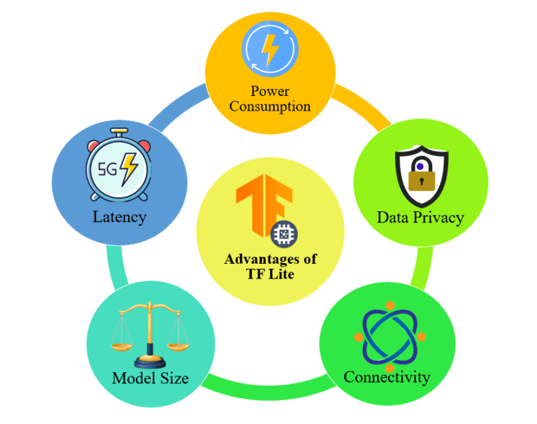

# Machine Learning - FruitMate

<h1 align="center">
  </img>

## About This App
The FruitMate application is an application that can help detect the level of fruit ripeness. It is equipped with additional features such as news, fruit information, fruit storage information, and plant care. This application is expected to assist users, especially farmers, in predicting which fruits are suitable to enter the market.

## Project Plan
The project plan file can be accessed at the following link: https://drive.google.com/file/d/1iUHJNwcBXzqq-hiii_t34qfCoUvwZK7y/view?usp=sharing

## List of Contents

1. [FruitMate Team Member](#team-member)
2. [Library Used](#library-used)
3. [IDE Used](#ide-used)
4. [Kaggle Link](#kaggle-link)
5. [Output Convert](#output-convert)
6. [API Endpoints](#api-enspoints)

## Team Member

The following are the team members involved in the development of this project:

| Name                                    | Student-ID  | Learning Path      | Role                                        | Contacts                                                                                                                  |
| :-------------------------------------- | :---------- | :----------------- | :------------------------------------------ | :------------------------------------------------------------------------------------------------------------------------ |
| Riesco Alief Frendnanda Editya          | M207DSX2302 | Machine Learning   | Project Manager & Machine Learning Engineer | [LinkedIn](https://www.linkedin.com/in/riesco-alief-frendnanda-editya-a65929244/) & [Github](https://github.com/riszt892) |
| Noraini Latifah                         | M207DSY3260 | Machine Learning   | Machine Learning Engineer                   | [LinkedIn](https://www.linkedin.com/in/norainilatifah/) & [Github](https://github.com/Noraini09)                          |
| I Wayan Guna Permana                    | C368DSX2417 | Cloud Computing    | DevOps Engineer                             | [LinkedIn](https://www.linkedin.com/in/i-wayan-guna-permana/) & [Github](https://github.com/gunapermana)                  |
| Anak Agung Made Semara Putra            | C368DSX2788 | Cloud Computing    | DevOps Engineer                             | [LinkedIn](https://www.linkedin.com/in/gungwahada1/) & [Github](https://github.com/Gungwahada1)                           |
| I Gusti Agung Ngurah Fajar Dharmawangsa | A013DSX1415 | Mobile Development | Android Developer                           | [LinkedIn](https://www.linkedin.com/in/ngurahfajar/) & [Github](https://github.com/NgurahFajar)                           |
| Muhammad Rafif Baihaqi                  | A013DSX1421 | Mobile Development | Android Developer                           | [LinkedIn](https://www.linkedin.com/in/muhammad-rafif-baihaqi-198b56226/) & [Github](https://github.com/Raff-28)          |

## Library Used

- Numpy
- Matplotlib
- Pathlib
- PIL
- TensorFlow
- TensorFlow Lite
- EfficientNetB3
- Keras in TensorFlow

## IDE Used

- Google Colab
- Visual Studio Code

## Kaggle Link

You can cath our dataset on kaggle.com using this link below:
https://www.kaggle.com/datasets/riescoalieffe/fruitmate

## Output Convert
<h1 align="center">
  </img>
 </h1>

We decided to convert the model into .TFLITE format. This decision was driven by the benefit of it, TFLITE format provide us the minimum power consumption, data privacy, connectivity, size, and model latency.
